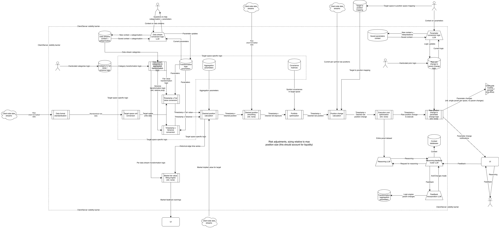

# APT — Automated Positional Trader

An advisory trading terminal for crypto options market-making desks. APT formalises position management into a configurable engine: plug in any data source, and the system tells you what your position should be and why.

---

## The Problem

Every trading firm's PnL decomposes into three multiplicative factors:

**PnL = Market Edge x Edge Share x Edge Retention**

**Market Edge** is how much mispricing exists in the market you've chosen. **Edge Share** is the fraction you capture through execution speed and queue priority. **Edge Retention** is the fraction you keep after managing your resulting position over time.

Market selection and execution infrastructure are well-understood problems. Edge Retention — specifically long-term position management — is not. Today, position management is a senior trader staring at a screen, mentally synthesising multiple data feeds (realized vol, scheduled events, historical IV percentiles, funding rates, cross-asset correlations) into a single decision: how much should we be long or short, and in what?

This does not scale. It is not transferable. It walks out the door when the trader leaves. And it is the single highest-leverage factor in determining whether a desk is profitable.

APT replaces this process with a formal, configurable engine that makes the same decision — continuously, explainably, and without key-person risk.

---

## A General Unifying Theory of Trading

APT is built on a single claim: every positional trading decision reduces to the same equation.

```
Desired Position = Edge x Bankroll / Variance
```

- **Edge** is Fair Value minus Market Implied — how much we think the market is mispricing something, and in which direction.
- **Variance** is the uncertainty of our fair value estimate. It scales with the absolute size of that estimate, weighted by our confidence in each contributing data source. Larger estimates mean more room to be wrong in absolute terms.
- **Bankroll** is the capital allocated to the strategy.

This is the entire theory. Position size is proportional to how much edge we see, and inversely proportional to how uncertain we are about it. Everything else — the data streams, the temporal logic, the cross-asset correlations — is infrastructure for computing Edge and Variance well.

### Signal Synthesis

Fair Value is not a single number from a single source. It is synthesised from multiple independent data streams, each expressing a view on what an asset should be worth. Realized vol, scheduled macro events, historical IV percentiles, funding rates, cross-asset correlation shifts — any data source that can be expressed as a view on fair value can be plugged into the engine as a configurable stream.

Each stream is parameterised by how it maps into a common target space, how it distributes its impact through time, how it aggregates with other streams (blending into a consensus or stacking as an independent additive layer), and its confidence weight (how much the desk trusts this particular signal). The engine does not privilege any stream — the framework is agnostic to the source. What matters is the parameterisation.

Market Implied is the market's current pricing, converted to the same units as Fair Value for direct comparison. Edge is the difference.

### Time

Time affects every part of the calculation. Some signals represent ongoing shifts in the expectation of future realised volatility — they roll forward continuously. Others are discrete events anchored to specific timestamps (FOMC, CPI, earnings). Decaying signals start at full strength and shrink over their lifetime, modelling how short-term edges erode as the market corrects an inefficiency.

Forward smoothing handles execution constraints: we cannot assume we can instantly reposition. The executable desired position adjusts gradually toward the ideal, reflecting real-world liquidity limitations.

---

## Epistemological Framework

APT enforces a strict epistemological discipline in how it communicates trading decisions. This is not incidental — it is a core product design decision.

**Epistemology over mechanics.** When a trader asks *why* the desired position changed, APT explains the conceptual trading logic — which data stream moved, whether edge or variance drove the change, and the directional effect on position. It never describes internal calculations or engine architecture. The engine implements a philosophy; the platform articulates the philosophy itself.

**Directional neutrality.** The desk has no inherent directional preference. No stream is a "headwind" or "tailwind." A stream contributing edge in the opposite direction to the total is simply doing that — state it factually. This prevents cognitive bias from leaking into the explanation layer.

**No absolute numbers.** Fair value is "above" or "below" market implied. Edge is "positive" or "negative", "more positive" or "less positive." This protects proprietary IP and is also more useful to a trader — relative framing maps directly to trading decisions. Position sizes are quoted in standard trading units ($vega) because the trader already sees them on screen.

**Temporal humility.** The platform observes the world through coarse snapshots. When a change first appears, it says the change is visible "as of" that timestamp — never that it "started at" that time. This prevents false precision about causality.

**Epistemic honesty.** The platform explicitly distinguishes what it knows from what it does not know. If it has historical data, it cites specific values to ground its reasoning. If it lacks historical context, it says so directly rather than fabricating a plausible narrative.

**Dual mandate.** The intelligence layer both explains position changes to traders and incorporates their feedback. A trader can adjust engine parameters through natural language ("reduce our exposure to BTC near-dated by half"), and the system translates this into precise parameter changes — but only after explicit confirmation.

---

## Systems Architecture



*Click the image to view full-size.*

The system is split across a **client** (the trader's machine) and a **server** (our cloud) with a deliberate visibility barrier between them. The client handles data ingestion, format standardisation, and display. All proprietary computation — fair value synthesis, variance estimation, position sizing, forward smoothing — runs exclusively on the server. The trader sees what they need to see; the calculation methodology stays protected.

The LLM intelligence layer sits between the engine and the trader. It reads the engine's current state and calculation breakdown, applies the epistemological framework described above, and produces explanations grounded in specific data streams. It also handles the reverse path: parsing trader feedback into structured engine parameter changes.

| Layer | Technology | Purpose |
|-------|-----------|---------|
| Desktop Terminal | Electron, React, TypeScript, Vite, Tailwind | Modular trading dashboard with draggable panels |
| Data Adapters | Python | Ingest and standardise client data into a common format |
| API Layer | FastAPI, WebSockets | Real-time bidirectional communication (position streaming + snapshot ingestion) |
| Pricing Engine | Python, Polars | Stream-to-position pipeline: fair value, variance, aggregation, desired position |
| Intelligence Layer | LLM via OpenRouter | Position explanations, justification narration, trader feedback incorporation |

---

## Tech Stack

| Component | Stack |
|-----------|-------|
| Desktop Client | Electron, React 19, TypeScript, Vite, TailwindCSS, react-grid-layout |
| Server | Python, FastAPI, Polars, WebSockets |
| LLM Integration | OpenRouter (async streaming, model fallback chains) |
| Deployment | Vercel (client), Railway (server) |

---

## Current Status

| Subsystem | Status | Notes |
|-----------|--------|-------|
| Pricing Engine (`server/core/`) | Production | Full pipeline operational, running on mock scenario data |
| API + WebSocket Layer | Production | Real-time pipeline ticks, auth-gated client ingestion |
| LLM Intelligence Layer | Production | Investigation chat (streaming) + justification narration |
| Desktop Terminal UI | Production | Modular dashboard, live position grid, pipeline charts |
| Data Adapters | Not built | Exchange-specific adapters pending |
